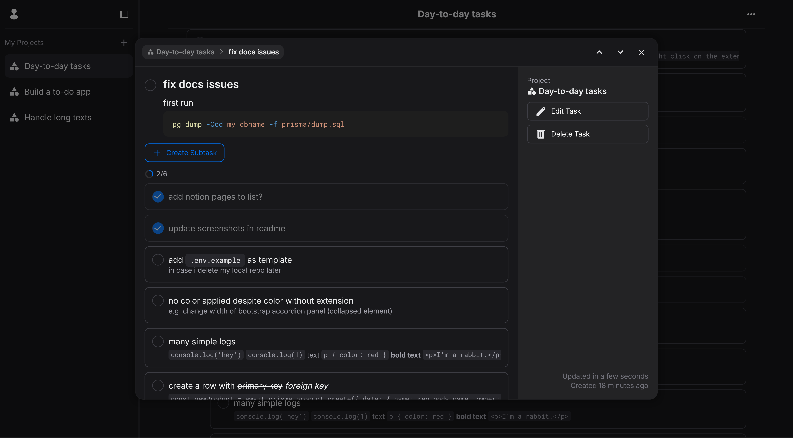

# Todo App

[A simple todo app](https://todoistmd.netlify.app) that supports Markdown, allows nesting and persists your custom sort order.

## Screenshots

## Built with

- [React](https://react.dev/)
- [Tanstack Query](https://tanstack.com/query/latest) - Async State Management
- [DndKit](https://dndkit.com/) - Drag-and-Drop Library
- [HeroUI](https://www.heroui.com/) - UI Library
- [Motion](https://motion.dev/) - Animation
- [React Router](https://reactrouter.com/en/main) - Routing
- [Zod](https://zod.dev/) - Schema Validation
- [Vitest](https://vitest.dev/) & [RTL](https://testing-library.com/docs/react-testing-library/intro/) - Testing
