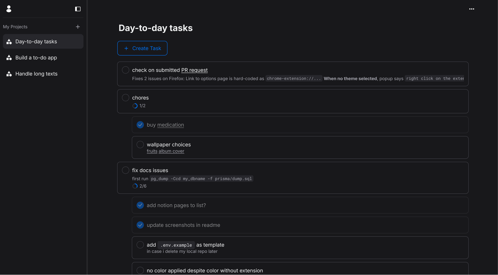

# Todo App

A simple todo app that persists your custom order.
Check it out [here](https://todo-fe-vietan0.netlify.app)!

## Screenshot

## Built with

- [React](https://reactjs.org/)
- [Tanstack Query](https://tanstack.com/query/latest) - Async State Management
- [DndKit](https://dndkit.com/) - Drag-and-Drop Library
- [NextUI](https://nextui.org/) - Component Library
- [Framer Motion](https://www.framer.com/motion/) - Animation
- [React Router](https://reactrouter.com/en/main) - Routing
- [Zod](https://zod.dev/) - Schema Validation
- [Vitest](https://vitest.dev/) & [RTL](https://testing-library.com/docs/react-testing-library/intro/) - Testing

---

Made by [Việt An](https://github.com/vietan0).
